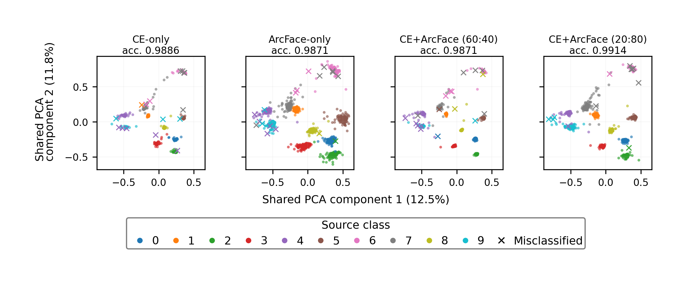

# DLMMDD Synthetic Source Attribution Challenge Solution

This repository contains the code used for the paper:

**Angular-Margin Representation Learning for Synthetic Image Source Attribution under Controlled Post-Processing Shifts: A Solution to the DLMMDD Synthetic Source Attribution Challenge**

The task is closed-set source attribution of synthetic face images generated by ten known text-to-image source generators. The solution is based on ConvNeXtV2, ArcFace-based angular-margin learning, self-supervised learning (SSL), input-resolution variants, test-time augmentation (TTA), and probability-level ensembling.

## Official challenge result

The official final submissions achieved:

| Submission | Public LB | Private LB | Note |
|---|---:|---:|---|
| Final A | 0.995333 | 0.992000 | Official final submission |
| Final B | 0.995333 | 0.992000 | Official final submission |
| Final C | 0.995333 | 0.992666 | Best official final submission |

The best selected submission achieved a private score of **0.992666**, resulting in a final rank of **6th place**.

The repository also includes a post-deadline diagnostic notebook. These diagnostic submissions were **not part of the official final ranking** and are provided only to support the retrospective analysis discussed in the paper.

## Repository structure

```text
dlmmdd-source-attribution/
├── README.md
├── requirements.txt
├── LICENSE
├── .gitignore
├── dlmmdd_solution_reproduction.ipynb
├── diagnostics/
│   └── ensemble_arcface_traingrid_norm_sweep.ipynb
├── Data/
│   └── README.md
└── ensemble_artifacts/
    └── README.md
```

## Paper-related diagnostic analyses

This repository also includes the post-challenge diagnostic analyses
used in the camera-ready paper:

**Angular-Margin Representation Learning for Synthetic Image Source
Attribution under Controlled Post-Processing Shifts**

The diagnostic analyses are separated from the official challenge
reproduction because they were conducted after the competition deadline.

### Analysis notebooks

- [`diagnostics/analysis/representation_analysis.ipynb`](diagnostics/analysis/representation_analysis.ipynb)  
  Reproduces the representation metrics in Table 1, the shared-PCA
  comparison in Figure 2, and the supplementary t-SNE visualization.

- [`diagnostics/analysis/postprocessing_robustness.ipynb`](diagnostics/analysis/postprocessing_robustness.ipynb)  
  Reproduces the controlled post-processing robustness results in
  Table 2.

### Diagnostic training notebooks

- [`diagnostics/training/train_ce_only_arcface_only.ipynb`](diagnostics/training/train_ce_only_arcface_only.ipynb)
- [`diagnostics/training/train_ce20arc80_paper.ipynb`](diagnostics/training/train_ce20arc80_paper.ipynb)
- [`diagnostics/training/ensemble_arcface_traingrid_norm_sweep.ipynb`](diagnostics/training/ensemble_arcface_traingrid_norm_sweep.ipynb)

### Paper-facing results

- [Table 1: representation metrics](results/diagnostics/table1_representation_metrics.csv)
- [Table 2: controlled post-processing robustness](results/diagnostics/table2_postprocessing_accuracy.csv)
- [Figure 2: shared-PCA comparison](results/diagnostics/figure2_shared_pca.png)
- [Supplementary t-SNE visualization](results/diagnostics/supplementary_tsne_fold0.png)
- [Notebook provenance and SHA-256 records](docs/NOTEBOOK_PROVENANCE.md)

Datasets, model checkpoints, probability arrays, and sample-level
outputs are intentionally excluded from the repository.

### Shared-PCA comparison



## Notebooks

### `dlmmdd_solution_reproduction.ipynb`

This is the main notebook for reproducing the official final submissions.

It contains branch-level training/inference code and the final ensemble generation code for:

- `arcface_base`
- `ssl_pre2_base`
- `convnextv2_base_512_arcface_ce60arc40`
- `512_arcface_base_postproc_aug_v1_inferacc`
- `arcface_base_old_ft768_v1`

It generates the following official final submissions:

- `official_final_A_submission.csv`
- `official_final_B_submission.csv`
- `official_final_C_submission.csv`

### `diagnostics/ensemble_arcface_traingrid_norm_sweep.ipynb`

This notebook contains CE/ArcFace balance-sweep and post-deadline diagnostic ensemble code.

It is provided to support the retrospective analysis in the Discussion section of the paper. The post-deadline diagnostic submissions were not part of the official final challenge evaluation.

## Dataset

The DLMMDD challenge dataset is not included in this repository. Download it from the Kaggle competition page and place the files under `./Data/`.

Expected files include:

```text
Data/
├── training.csv
├── test.csv
├── train/
└── test/
```

The exact image-directory names should match the paths expected by the notebooks.

## Outputs

Generated checkpoints, probability files, OOF files, and submissions are saved under:

```text
ensemble_artifacts/
```

This directory is ignored by Git because it can contain large files such as `.pth`, `.npy`, and generated `.csv` files.

## Quick start

1. Install the required packages.

```bash
pip install -r requirements.txt
```

2. Download the competition dataset from Kaggle and place it under `./Data/`.

3. Run the main notebook:

```text
dlmmdd_solution_reproduction.ipynb
```

Running all cells from scratch may take a long time depending on hardware. If the branch-level `*_test_probs.npy` files are already available, users can run only the final ensemble cell to regenerate the official final submission files.

4. Optional: run the diagnostic notebook:

```text
diagnostics/ensemble_arcface_traingrid_norm_sweep.ipynb
```

This notebook is for post-deadline diagnostic analysis and is not required for reproducing the official final submissions.

## Reproducibility notes

- The official final submissions were selected before the private leaderboard was released.
- Public and private leaderboard scores are reported with six decimal places, following the official leaderboard display.
- The post-deadline diagnostic experiments are included for analysis only and should not be interpreted as official challenge results.
- The exact runtime depends on hardware, CUDA/cuDNN versions, storage speed, and whether branch probability files are regenerated from scratch.

## AI assistance disclosure

Parts of the code organization, commenting, and documentation preparation were supported by ChatGPT. The author reviewed, modified, and validated the code, experimental settings, and reported results. All final methodological decisions, experiments, and responsibility for the released code remain with the author.

## License

This repository is released under the MIT License. See `LICENSE` for details.
